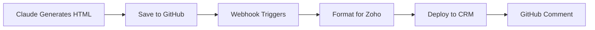

# Claude Email Template Workflow

🤖 **Automated workflow for generating, versioning, and deploying email templates from Claude to Zoho CRM via GitHub.**

[](https://nodejs.org/)
[](https://opensource.org/licenses/MIT)

## 🚀 Quick Start

1. **Clone the repository**
   ```bash
   git clone https://github.com/roweldencinares-git/claude-email-template-workflow.git
   cd claude-email-template-workflow
   ```

2. **Install dependencies**
   ```bash
   npm install
   ```

3. **Set up environment variables**
   ```bash
   # Create .env file with your credentials
   ZOHO_CLIENT_ID=your_zoho_client_id
   ZOHO_CLIENT_SECRET=your_zoho_client_secret
   ZOHO_REFRESH_TOKEN=your_zoho_refresh_token
   GITHUB_TOKEN=your_github_token
   WEBHOOK_SECRET=your_webhook_secret
   ```

4. **Start the webhook server**
   ```bash
   npm start
   ```

5. **Generate your first template**
   - Use a prompt from `email-templates/prompts/`
   - Ask Claude to generate HTML using the prompt
   - Save to `email-templates/generated/`
   - Commit and push → Automatic deployment to Zoho CRM!

---

## 🔄 How It Works

### Automated Workflow: Claude → GitHub → Zoho CRM



1. **Generate Template with Claude**
   - Use prompt templates from `email-templates/prompts/`
   - Request mobile-responsive HTML with inline CSS
   - Ensure Zoho compatibility (no JS, external CSS)

2. **Commit to GitHub**
   - Save generated HTML to `email-templates/generated/`
   - Use descriptive commit message: `feat: add newsletter template`
   - Push to repository

3. **Automatic Deployment**
   - Webhook detects email template changes
   - Formats HTML for Zoho compatibility
   - Deploys directly to Zoho CRM Email Templates
   - Adds GitHub comment with deployment status

---

## 📂 Project Structure

```
claude-email-template-workflow/
├── email-templates/
│   ├── prompts/                    # Claude prompt templates
│   │   ├── event-invitation.md
│   │   ├── newsletter.md
│   │   └── product-announcement.md
│   ├── generated/                  # Generated HTML templates
│   │   └── q3-reset-invite.html
│   └── README.md
├── webhook-server.js               # Express server for GitHub webhooks
├── zoho-client.js                  # Zoho CRM API client
├── github-client.js                # GitHub API client  
├── format-for-zoho.js              # HTML formatter for Zoho compatibility
├── package.json
└── README.md
```

---

## 🛠️ Available Prompt Templates

### 📅 Event Invitation (`email-templates/prompts/event-invitation.md`)
Perfect for conferences, webinars, company events
- Event details with date/time/location
- Calendar integration CTA
- Professional styling

### 📰 Newsletter (`email-templates/prompts/newsletter.md`)
Ideal for regular company updates
- Article grid layout
- Featured content section
- Social media integration

### 🚀 Product Announcement (`email-templates/prompts/product-announcement.md`)
Great for new feature launches
- Product hero image
- Feature highlights
- Launch date information

---

## 🔧 Setup & Configuration

### 1. Zoho CRM Setup
1. Create Zoho CRM app in [Zoho API Console](https://api-console.zoho.com/)
2. Get Client ID, Client Secret, and Refresh Token
3. Ensure proper scopes: `ZohoCRM.settings.email_templates.ALL`

### 2. GitHub Webhook Setup
1. Go to your repository Settings → Webhooks
2. Add webhook URL: `https://your-domain.com/webhooks/github`
3. Select "Push" events
4. Set webhook secret

### 3. Environment Variables
Create `.env` file:
```env
ZOHO_CLIENT_ID=your_zoho_client_id
ZOHO_CLIENT_SECRET=your_zoho_client_secret
ZOHO_REFRESH_TOKEN=your_zoho_refresh_token
GITHUB_TOKEN=your_github_token
WEBHOOK_SECRET=your_webhook_secret
ZOHO_EMAIL_FOLDER_ID=optional_folder_id
```

---

## 📋 Manual Workflow (Backup)

When automation isn't available:

1. **Generate Template with Claude**
   ```
   Use prompts from email-templates/prompts/ to generate HTML
   ```

2. **Format for Zoho**
   ```bash
   node format-for-zoho.js path/to/template.html
   ```

3. **Manual Deployment to Zoho CRM**
   - Login to Zoho CRM
   - Go to **Setup** → **Templates** → **Email Templates**
   - Create new template and paste formatted HTML

---

## ✅ Zoho Compatibility Checklist

- ✅ Inline CSS only (no external stylesheets)
- ✅ No JavaScript code
- ✅ No external resources (fonts, images should be hosted)
- ✅ Mobile-responsive design
- ✅ Maximum width: 600px
- ✅ Table-based layout for email clients

---

## 🔧 Troubleshooting

### Template Not Deploying Automatically
1. Check webhook server logs: `npm start`
2. Verify file is in `email-templates/generated/` folder
3. Ensure commit message includes keywords: `feat:`, `add:`, `update:`

### Formatting Issues in Zoho
1. Run format script: `node format-for-zoho.js template.html`
2. Review compatibility warnings
3. Test in Zoho CRM preview

### Webhook Not Triggering
1. Check GitHub webhook delivery logs
2. Verify webhook URL is accessible
3. Confirm webhook secret matches environment variable

---

## 🚀 Deployment

### Local Development
```bash
npm start  # Runs on http://localhost:3000
```

### Production Deployment
Deploy to any Node.js hosting service:
- Heroku, Vercel, AWS Lambda, etc.
- Ensure environment variables are set
- Set webhook URL to your deployed domain

---

## 📝 License

MIT License - see [LICENSE](LICENSE) file for details

---

## 🤝 Contributing

1. Fork the repository
2. Create feature branch: `git checkout -b feature-name`
3. Commit changes: `git commit -m 'Add feature'`
4. Push to branch: `git push origin feature-name`
5. Submit pull request

---

## 📞 Support

- 📧 Issues: [GitHub Issues](https://github.com/roweldencinares-git/claude-email-template-workflow/issues)
- 📖 Documentation: See `email-templates/README.md` for detailed workflow instructions
- 🤖 Generated with [Claude Code](https://claude.ai/code)